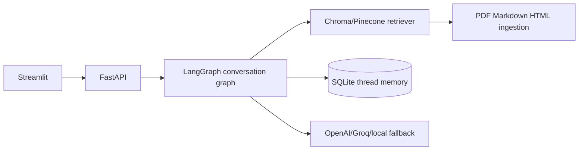

# Conversational RAG Chatbot

A practical LangChain/LangGraph conversational retrieval application with FastAPI and Streamlit. Chroma is the default local vector store, SQLite stores thread-scoped memory, and OpenAI/Groq are optional (a deterministic local fallback makes development offline-friendly).

## Quick start
PowerShell:
```powershell
python -m venv .venv
.venv\Scripts\Activate.ps1
pip install -r requirements.txt
uvicorn app.main:app --reload
```

Command Prompt:
```bat
python -m venv .venv
.venv\Scripts\activate.bat
pip install -r requirements.txt
```

Git Bash:
```bash
source .venv/Scripts/activate
pip install -r requirements.txt
```

Start the Streamlit UI in a second terminal after starting the API:
```powershell
.venv\Scripts\python.exe -m streamlit run ui\streamlit_app.py
```

Keep both terminals running. If Streamlit reports `localhost:8000` connection
refused, start the API terminal first:
```powershell
uvicorn app.main:app --reload
```
Set `GROQ_API_KEY` and `GROQ_MODEL=openai/gpt-oss-20b` in `.env` for hosted answers. ChromaDB is the default vector store. Without a key, the fallback extracts relevant sentences from indexed documents.

## API
* `GET /health` — readiness and configured providers
* `POST /upload` — multipart `file`, optional `user_id`, `thread_id`
* `POST /sessions` — create a session (`{"user_id":"alice"}`)
* `GET /sessions/{user_id}` — list sessions
* `POST /chat` — `{"user_id":"alice","thread_id":"...","message":"..."}`.
OpenAPI is available at `/docs`.

Uploaded temporary files are deleted after indexing. Their chunks persist in Chroma at
`data/chroma`, and conversation sessions/messages persist in SQLite at
`data/memory.db`, so indexed content and memory survive API/UI restarts. Supported
ingestion formats are PDF, Markdown, and HTML. Metadata includes document type,
version, section headers, page (PDF), and fenced code blocks. The LangGraph workflow
contains query understanding, query rewriting, retrieval routing, context synthesis,
conversation summarization, memory management, and orchestrator nodes.

## Configuration
`VECTOR_DB=chroma` (default) or `pinecone`; `CHROMA_DIR`, `SQLITE_PATH`, `TOP_K`, `OPENAI_MODEL`, `GROQ_MODEL`, and `EMBEDDING_MODEL` are configurable. Pinecone requires `PINECONE_API_KEY` and `PINECONE_INDEX`.

## Architecture


## Docker
`docker compose up --build` starts the app, Chroma, and PostgreSQL. SQLite remains the default memory backend; PostgreSQL is provided for deployments that wish to extend persistence.

## Sample conversations
1. Upload `docs/architecture.md`, ask “What stores conversation memory?”, then ask “What is the default vector database?” (the second question uses thread history).
2. Upload `docs/python-style.md`, ask “Show the retry example” to exercise code-block metadata.

## Benchmark guidance
Measure upload latency, p50/p95 chat latency, retrieval hit-rate (known answers in `docs/`), and answer faithfulness over 20 representative questions. Run with `TOP_K=3`, then compare 5; record CPU/RAM and embedding model. Hosted LLM latency and token usage should be reported separately from retrieval.
